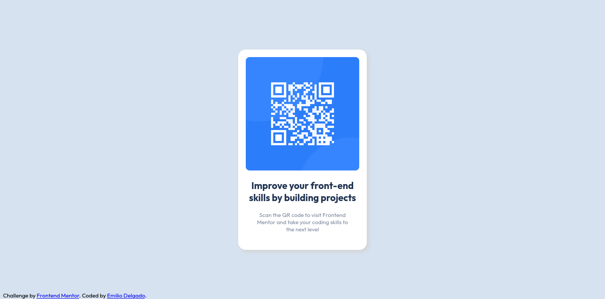

# Frontend Mentor - QR code component solution

This is a solution to the [QR code component challenge on Frontend Mentor](https://www.frontendmentor.io/challenges/qr-code-component-iux_sIO_H). Frontend Mentor challenges help you improve your coding skills by building realistic projects. 

## Table of contents

- [Overview](#overview)
  - [Screenshot](#screenshot)
  - [Links](#links)
- [My process](#my-process)
  - [Built with](#built-with)
  - [Continued development](#continued-development)
  - [Useful resources](#useful-resources)
- [Author](#author)

## Overview

### Screenshot

Desktop screenshot 

Mobile screenshot

### Links

- Solution URL: [Add solution URL here](https://www.frontendmentor.io/solutions/qr-component-with-basic-htmlcss-VUDQh3Hit)
- Live Site URL: [Add live site URL here](https://musing-ritchie-4ed799.netlify.app/)

## My process

### Built with

- HTML5
- CSS

### Continued development

This project lacks some restructure of the CSS code, it feels like it's patched up and there are some directives that I yet do not fully understand (just that they work), so in future iterations and projects I will be sure to add:

- Media queries 
- Responsive units

### Useful resources

- [CSS Vertical Align (freecodecamp.org)](https://www.freecodecamp.org/news/css-vertical-align-how-to-center-a-div-text-or-an-image-example-code/) - Used the examples to center the div both horizontally and vertically with respect to the whole document

## Author

- Frontend Mentor - [@carninesix](https://www.frontendmentor.io/profile/carninesix)

